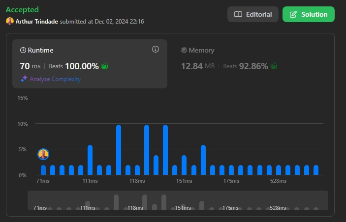
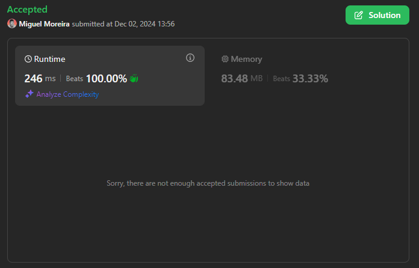
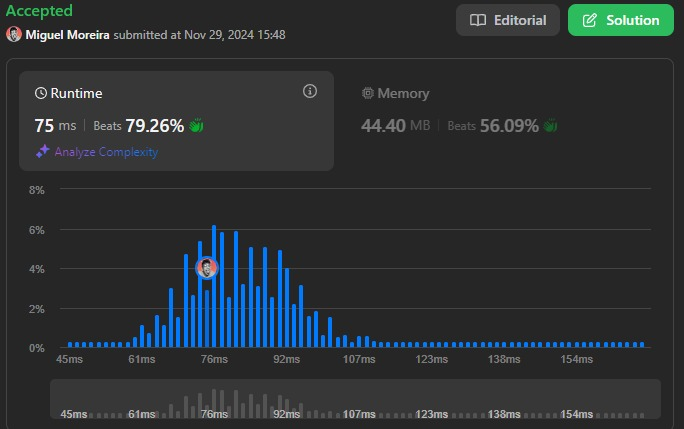
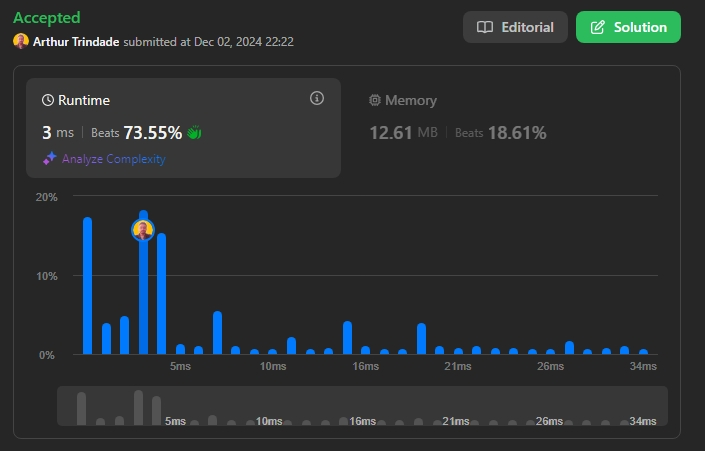

# Desafios LeetCode: Grafos

**Número da Lista**: 46 
**Conteúdo da Disciplina**: Grafos 2  

## 👥 Alunos
| Matrícula   | Aluno           |
|-------------|------------------|
| 18/0098080  | Arthur Trindade  |
| 20/2023968  | Miguel Moreira   |

## 📝 Sobre
Este repositório contém a solução de quatro desafios de grafos do juiz online LeetCode. Foram resolvidas as questões difíceis de números **847** e **2322**, e as questões de dificuldade média de número **684** e **743**.

**Tecnologias Utilizadas**: C e Python

### Desafios Solucionados
| Código | Desafio                                                                                                      | Dificuldade |
|--------|--------------------------------------------------------------------------------------------------------------|-------------|
| 847    | [Shortest Path Visiting All Nodes](https://leetcode.com/problems/shortest-path-visiting-all-nodes/description/) | Difícil     |
| 2322   | [Minimum Score After Removals on a Tree](https://leetcode.com/problems/minimum-score-after-removals-on-a-tree/description/) | Difícil     |
| 743    | [Network Delay Time](https://leetcode.com/problems/network-delay-time/description/)                          | Média       |
| 684    | [Redundant Connection](https://leetcode.com/problems/redundant-connection/description/)                      | Média       |

## 📸 Screenshots

  

  Resultado da submissão da solução para o desafio 847.

  

  Resultado da submissão da solução para o desafio 2322.

  

  Resultado da submissão da solução para o desafio 743.

  

  Resultado da submissão da solução para o desafio 684.

## 🚀 Uso
Para testar cada desafio:
1. Clique no link do desafio na tabela de questões da seção **Sobre**.
2. Cole o código referente ao desafio no campo de texto disponível na página do LeetCode.
3. Clique em **Run** para rodar a solução.

## 📚 Outros
Este projeto visa exercitar conceitos de grafos, abordando diferentes níveis de dificuldade em problemas propostos no LeetCode, focando em construção de grafos, manipulação de arestas e algoritmos de otimização.

## 🎥 Entrega de Vídeo

Para complementar a explicação das soluções e facilitar o entendimento dos conceitos aplicados em cada desafio, incluímos uma apresentação em vídeo.

### 📹 Link para o Vídeo
[Entrega de Grafos 2 (847 e 684)](https://youtu.be/9S6w01Sk8Sc)  
[Entrega de Grafos 2 (2322 e 743)](https://youtu.be/WYRNyRq0BjY)
